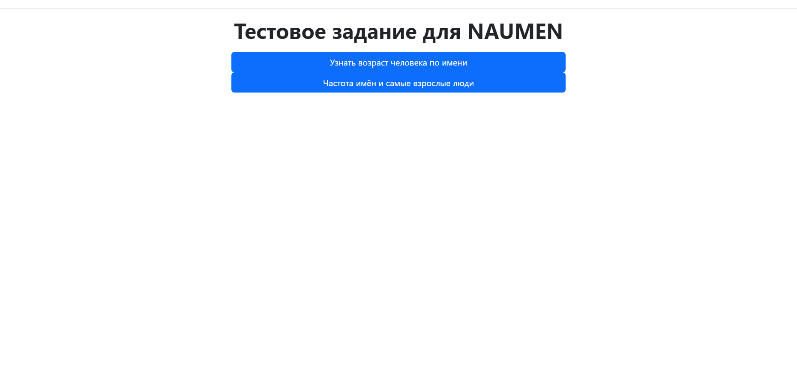
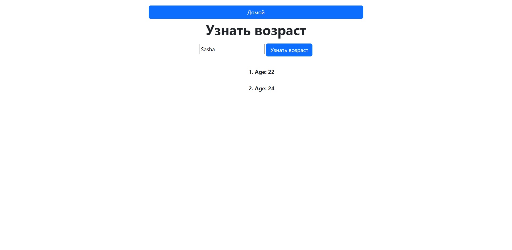
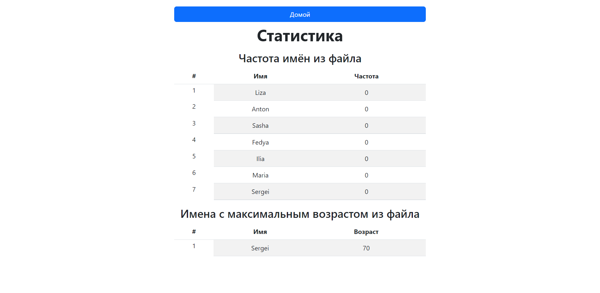
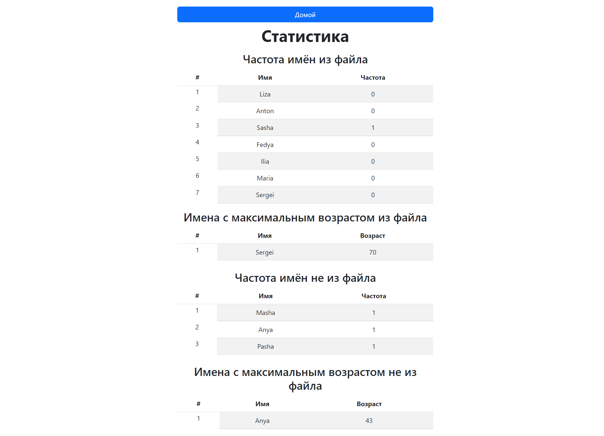

## Тестовое задание на стажировку в Naumen

Web-приложение на Java, которое может:

- Считывать из текстового файла строки формата
  имя_возраст. Например: Андрей_27. Путь до файла: resources/data/names
- Предоставлять веб-интерфейс с полем ввода
  для произвольного имени. После отправки имени на сервер
  в ответ приходит возраст, соответствующий этому
  имени в файле. Если имени в файле нет, то идет запрос на внешний сервер и уже оттуда получаем возраст.
  Например, https://api.agify.io/?name=Jack. Если полученный возраст равен null, то присваиваю возраст 404.

- Предоставлять возможность ведения просмотра
  статистики запросов по каждому имени:
    - вывод частотности запросов в разрезе имён отдельно для файла, и внешнего сервиса
    - вывод имени с наибольшим возрастом. Если запрашивали человека, которого нет в файле, то он тоже может быть
      выведен. Люди, которые получили возраст 404, здесь не выводятся.

Пожелания к реализации

+ В качестве серверного фреймворка использую Spring.
+ Приложение поддерживает работу с внешним
  сервисом, который возвращает возраст произвольных
  имен, если их нет в текстовом файле.
  Например, https://api.agify.io/?name=Jack

- http://localhost:8080/ или http://localhost:8080/user

- http://localhost:8080/user/get_age

- http://localhost:8080/user/statistics (пока не использовали внешний сервис)

- http://localhost:8080/user/statistics (с использованием внешнего сервиса)
